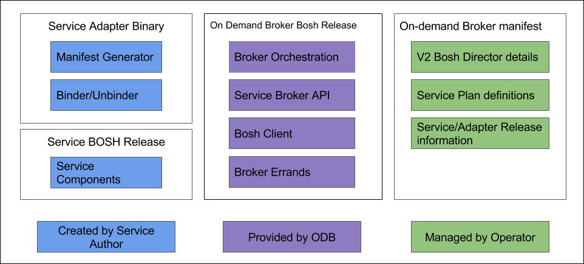

## About Cloud Foundry Service Brokers

A Cloud Foundry service broker allows application developers to provision services to be used by their Cloud Foundry apps. They are implemented as HTTP servers that conform to the [service broker API](http://docs.cloudfoundry.org/services/api.html). These brokers are registered with Cloud Controller in order to populate a service marketplace.

## About On-Demand Service Brokers

An on-demand Cloud Foundry service broker is a service broker that provisions IAAS resources at service instance creation time, as opposed to pre-provisioning a fixed quantity of these resources at broker deployment time. The **On-demand Service Broker (ODB)** is an SDK that you can use to create generic, on-demand, service brokers for single service offerings where one service instance corresponds to one BOSH deployment. Single tenant means a dedicated service process/cluster for each Cloud Foundry service instance.

Service-specific functionality is plugged in by the service author via an executable called a **Service Adapter**. For more information about the responsibilities of Service Authors, please see [Creating the Service Author Deliverables](creating.html).

The ODB leverages native platform features, such as BOSH, Pivotal Cloud Foundry Operations Manager, and Pivotal Elastic Runtime. No additional or third-party components other than the service broker and the BOSH release for the service itself are required. This simplifies the setup. Everything is done through the single install process. This approach also simplifies support because there are fewer moving parts, and your customer's network needs less customizing of DNS rules and additional firewall ports.

The ODB is the standard approach to deploying on-demand services across Pivotal products and the independent software vendor (ISV) ecosystem of partners.

This approach does not impose any constraints on the service authors' ability to offer new functionality or expose configuration options in their service plans, such as rate limiting and external load balancers.

## About Service Adapters

A service adapter is a binary that is called out by the ODB when it wants to do service-specific tasks.

The above diagram shows where responsibility lies for each aspect of the ODB workflow.

The service author can focus on building the BOSH release of their service and provide a service adapter binary that manages manifest generation,  binding, and unbinding. The ODB manages all interactions with Cloud Foundry and BOSH.

The operator then configures a range of plans for the service in the ODB BOSH manifest. This gives the operator control of what service configurations to offer their app developers. It also gives operators a consistent experience installing, configuring, and upgrading Pivotal products.

## Benefits of ODB

The benefits of provisioning IaaS resources on-demand are:

* Scale resource consumption linearly with need, without having to plan for pre-provisioning.
* App developers get more control over resources, and do not have to do acquire them through the operator.

## The benefits of using ODB to develop on-demand service offerings are:

* ODB reduces the amount of code service developers have to write by abstracting away functionality common to most single-tenant on-demand service brokers.
* ODB uses BOSH to deploy service instances, so anything that is BOSH-deployable can integrate with Cloud Foundry's services marketplace.

### BOSH v2 Features Used

ODB uses the following BOSH features:

* Dynamic IP management
* Availability zones
* Globally-defined resources (**Cloud Config**). This results in manifests that are portable across BOSH CPIs, and are substantially smaller than old-style manifests.
* Links between deployed BOSH instances consuming information, e.g. IP addresses, of other instances.

## Procedures for Using ODB

The following procedures outline how to set up, create and maintain a service tile based on the ODB SDK:

* [Setting up your BOSH director](operating.html#configure-bosh) — The operators ensure that minimum versions of Cloud Foundry and BOSH are available.
* [Creating the Service Author Deliverables](creating.html) — The service authors provide their deliverables.
* [Deploying an On-Demand Service Broker](operating.html) — The operators upload their releases and write a manifest.

**[Back to Contents Page](index.html)**
